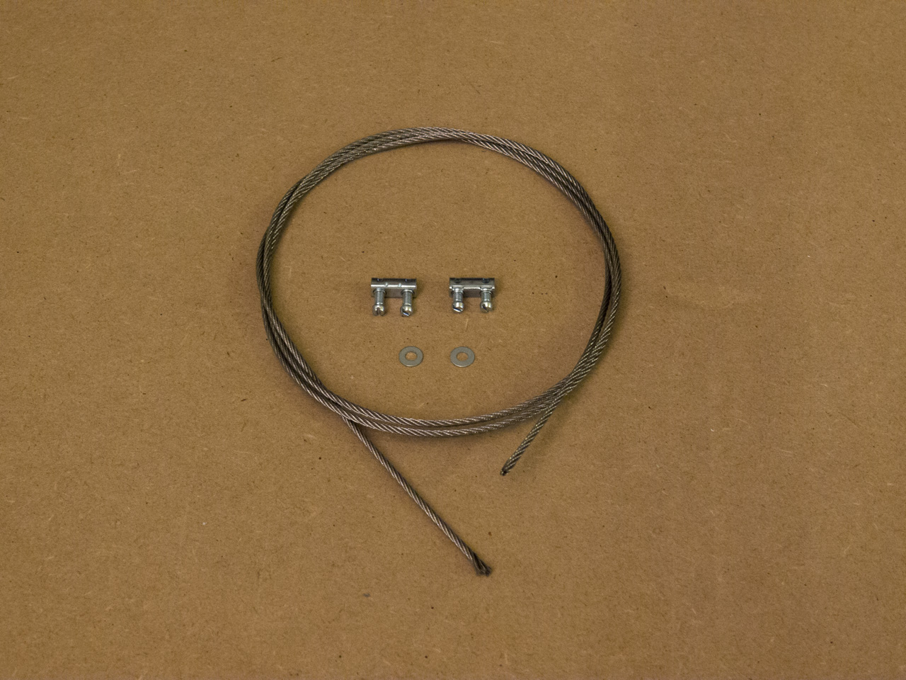

##Passo 1

Coloque 8 parafusos M5-10mm como descrito na figura bem como as respectivos Tee Nuts.
Repita este procedimento para as outras 3 peças.  

##Passo 2

Introduza 4 tee nuts num perfil de aluminium, tenha em atenção pois a parte saliente de cada Tee nut tem que ficar para o lado de dentro do perfil.
Repita este procedimento mais 3 vezes.
Este 4 perfis farão a base da máquina e estes 4 Tee Nuts, por varão vão servir para fixar a impressora á plataforma de madeira, que servirá de base.
 
##Passo 3

Encaixe um perfil de aluminium ao alto, em cada peça previamente preparada no passo 1, tal como se apresenta na figura ao lado.

##Passo 4

Coloque os varões, previamente preparados no passo 2, assegurando que os 4Tee nuts ficam virados para o lado de dentro da máquina.
É importante que a peças impressas fiquem com a disposição como se apresentam na figura.

##Passo 5

Efetue a montagem do carril do eixo Z como descrita na imagem.
repita este passo 3 vezes.
Introduza um carril em cada perfis que se encontra na vertical.
Tenha em atenção que os espaçadores excêntricos tem que está rodados de forma a que as rodas não façam força no perfil de aluminium.  
Após a sua instalação a tensão nas rodas deve ser ajustada
rodando os excêntricos até sentir que as rodas ficam á justa e não rodam só por si. 

##Passo 6

Coloque 8 parafusos M5-10mm como descrito na figura bem como as respectivos Tee Nuts.
Repita este procedimento para as outras 3 peças.  

##Passo 7

Neste passo vamos colocar 4 perfis de aluminium juntamente com as peças preparadas no passo anterior fazendo assim um “Moldura” e por sua vez colocamos essa moldura no topo da estrutura.
Mais uma vez é importante ter em conta a orientação das partes impressas.
A frente da nossa impressora vai ser o lado onde, na figura, se encontra a mão amarela.

##Passo 8

Introduza um parafuso M5 10mm juntamente com um teenut em cada um dos carris de z. em seguida introduza um perfil de aluminium  de um carri de z para o outro ( é importante que esses dois perfiz fiquem nas laterais da máquina).
Em seguida introduza 3 tee nuts em cada um dos perfis bem. em cada um desses tee nuts introduza um parafuso a fim de fixar um angulo de aluminium como se apresenta na figura.

##Passo 9

Sobre os dois perfis colocados previamente no carril de z, coloque 3 perfis de aluminium que vão ser fixados na parte de baixo dos “ângulos” de aluminium previamente colocados.
É importante que estes perfis fiquem mais ou menos equidistantes.
Em seguida coloque 3 tee nuts por perfil e uma peças quandradas como se apresenta na figura ao lado fixada em cada tee nut.
Mais uma vez é importante que as peças fiquem mais o menos equidistantes.   

##Passo 10

Introduza duas porcas M5 ( uma em cima outra em baixo)  em cada uma das peças quadradas previamente fixadas nos prefis. 
Em seguida rosque uma manipulo de reguração de altura em cada uma das estruturas previamente montadas (peça quadrada fixada no perfil e com duas porcas M5).
Em seguida no topo de cada varão coloque um pé
Coloque um perfil em U na horizontal sobre os “pés” sendo que cada perfil vais estar sobre 3 desse pès. 

##Passo 11

Introduza o carri de X num perfil de aluminium e em seguida coloque em cada extremidade do perfil uma carruagem de Y como na figura.
É importante respeitar a disposição dos carris.
no caso de ter os carris pré montado retire dos carris de Y as duas rodas que ficam orientadas par fora, a fim de introduzir a estrutura na montagem já efectuada.

##Passo 12

Instale os 4 motores de Z nas peças impressas como de acordo com a figura bem como os acopladores.
Em seguida coloque uma porca M8 em cada um dos carris de Z.  
Em seguida rosque o varão de cima para baixo passando pela porca e fixando no acoplador.
Para trancar o varão coloque duas porcas no topo do varão e aperte uma contra a outra.

##Passo13

Introduza os motores ( X Y ) na peças impressas que se encontram nos cantos superiores da montagem bem como um pulley em cada motor.

##Passo14

Olhando de frente para a máquina, introduza a montagem do fim de curso, no carril de z de acordo com a figura.

##Passo 15

Olhando de frente para a máquina.
No perfil de aluminium superior introduza 4 Tee Nuts e no perfil inferior 1 Tee Nut. 
Instale a montagem do fixador do guida de cabos, no centro do perfil de aluminium superior. Logo ao lado direito instale a montagem do extrusor de acordo com a figura.
Em seguida fixe o perfil que vai guiar os cabos no perfil inferior.
É importânte respeitar sempre a orientação das montagen em relação á imagem.  

##Passo 16

Neste passo é muito importante fazer o corte do cabo de aço de forma a que não fique desfiado pois isso felicitará os seguintes passos. 
Corte o cabo de aço em 8 partes iguais, de comprimento igual a diagonal da máquina.
Em cada um dos cantos impressos tem 2 parafuso fixos por uma porca. Desaperte todos os parafusos de forma a ficarem o mais para fora possivel mas fixos á porca.

Introduza uma peça de fixação na extremidade de um cabo de aço e uma anilha, aperte os 2 parafusos. 
Em seguida passe o cabo por um dos parafusos que encontra já instalado num dos cantos impressos e passe também pelo parafusos do canto oposto ficando o cabo na diagonal.
Introduza uma anilha na ponta do cabo de aço e de seguida uma peça de fixação, estique o cabo e com o cabo em tensão aperte os 2 parafusos do fixador.
Repita estes passos para as outras 7 diagonais da máquina.
Por fim aperte os parafusos por onde o cabo passou até estarem em tesão.

